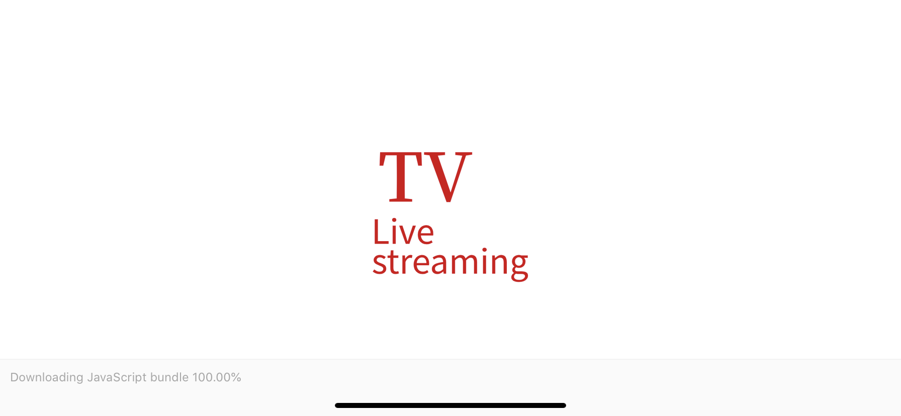
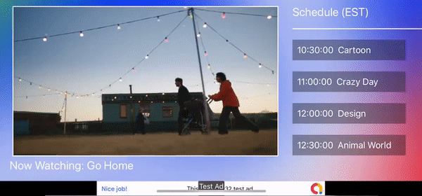

# TvOS_public
 
React Native Expo app for Android and Apple
implement google ads and customized styled 

## Installation
Use [Git](github.com/linyoujie/TvOS4public.git) to get repository.

```bash
yarn install
expo start
```

## Screenshot




## Contributing
Pull requests are welcome. For major changes, please open an issue first to discuss what you would like to change.

Please make sure to update tests as appropriate.

## License
[MIT](https://choosealicense.com/licenses/mit/)
